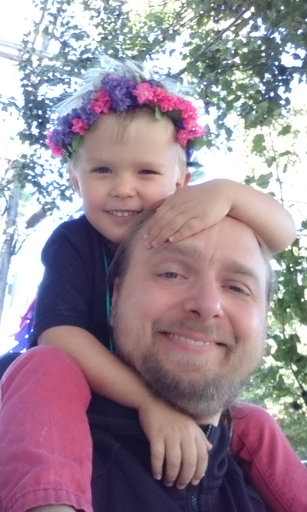

Hello!
======

I'm Piotr Mitros, and I'm running for your Cambridge School Committee.

Why I am running
--------------------

The Cambridge School District is performing greatly below its
potential. We spend [$27,569 per
student](http://profiles.doe.mass.edu/state_report/ppx.aspx) -- more
than [double](https://nces.ed.gov/fastfacts/display.asp?id=66) the
national average and the fourth highest in the state. We have
connections to top education programs at schools such as MIT,
Harvard, Lesley, and Tufts. We have some of the greatest
teachers in Massachusetts. However, we still have several several
failing schools. Many richer parents are choosing to leave the
district, either for the suburbs or private schools, while many poorer
children are failing basic math and literacy exams. We know how to
solve these problems. We've solved these problems in [many
places](https://khanacademy.zendesk.com/hc/en-us/articles/202260264-Is-Khan-Academy-effective-How-is-it-different-than-other-resources-available-),
and in [many different
ways](https://www.nytimes.com/2016/11/06/opinion/sunday/schools-that-work.html). I've
personally lead many projects which have lead to tremendous learning
gains, both for disadvantaged and advantaged students worldwide.

In short, I think we can do better. I have the experience closing
achievement gaps, in helping students succeed, and in helping
organization perform at a very high level across a range of
settings. I'd like to bring that experience to improve your schools.

I'm also the proud father of a child entering CPSD, and I've already
seen several things which have concerned me. Making positive change
happen quickly is an absolute top priority for me. That's why I'm
running.

What you can do to help
---------------

First, you can talk to me or email me. I'd be interested in your
thoughts about how we can make the school district better.

Second, you can [donate to my
campaign](https://secure.actblue.com/donate/mitros), help spread the
word, and remember to vote in November. Local elections are
surprisingly expensive; we need money for:

* Mailings. Cambridge has around 100,000 people, of whom about 50,000
  are registered to vote, and perhaps
  [13,000](https://www.cctvcambridge.org/node/29005) vote in municipal
  elections. They need to know who I am.
* If there's money left over, things like yard signs, business cards,
  launch parties, and similar really do help
* If there's money left over after that, there are web services which
  help manage elections. Aside from having apps which help guide me as
  I'm going door-to-door, they help follow all the election rules
  (financial reporting guidelines and similar), keeping me out of
  trouble

Finally, you can join my committee and help campaign as a volunteer.

My background
-----------------------

* **Chief Scientist of edX**. I served for over a half-decade as the
    Chief Scientist of an MIT-Harvard organization designed to broadly
    improve quality of and reduce cost of university education
    worldwide. [Read more](edx)
* **Teaching experience across diverse cultures**. I have experience
    in education across a diverse range of cultures, ranging from
    [China](http://web.mit.edu/mit-ceti/www/reports/past.htm), to
    [Nigeria](http://mitros.org/p/carnegie_reporter.pdf), to Jordan,
    and in many [international
    projects](http://mitros.org/p/#cultures) in even more
    nations. There are effective practices for serving culturally
    diverse populations worldwide which aren't being applied in
    CPSD which I would like to bring back to CPSD.
* **Experience with constructivist learning**. I have been involved in
    a range of experiments around project-based and group learning,
    both
    [in-person](http://tll.mit.edu/sites/default/files/library/files/EvalRept6002ex-Spring03.pdf)
    and
    [on-line](http://davecormier.com/edblog/2014/02/17/building-an-introductory-physics-course-cmooc-meets-xmooc/).
* **Policy experience**. I have served on policy-guiding bodies
    through the [National Science
    Foundation](http://cra.org/wp-content/uploads/2015/10/CRAEducationReport2015.pdf),
    the [National Academy of
    Education](https://naeducation.org/workshop-on-big-data-in-education-balancing-research-needs-and-student-privacy/),
    and for the [European
    Commission](https://publications.europa.eu/en/publication-detail/-/publication/94cb5fc8-473e-11e7-aea8-01aa75ed71a1/language-en/format-PDF/source-31396079). I
    served as an expert on issues concerning privacy, uses/misuses of assessment, as
    well as use of big data in education.
* **Business experience**. I was a co-founder or key early employee at
    three new organizations, all of which crossed the $100 million
    mark. I want to bring that organizational experience back to help
    empower and support teachers, students, and parents to improve our
    school system.
* **Academic experience**. I hold BS, MS, and Ph.D degrees, all from
    MIT. My [academic lineage](http://mitros.org/p/#geneaology)
    includes educators such as [Jerry
    Sussman](https://en.wikipedia.org/wiki/Gerald_Jay_Sussman) and
    [Seymour Papert](https://en.wikipedia.org/wiki/Seymour_Papert). [Read more](academic.md)
* I am a CPSD parent, and have been a resident of Cambridge for most
    of my life.

I've seen good ideas and bad ideas in educational systems all around
the world, and in diverse educational research communities. I would
like to work to integrate these to make our school system better.

Platform
-----------------

* **Bottom-up innovation.** Progress ought to come from students,
    parents, researchers, and teachers. See [my plan for empowering
    students, teachers, and parents](empowerment.md).
* **Effective, transparent management.** While I've been impressed
    with most individuals in the district, the overall organizational
    dynamics connecting those individuals are broken. I'd like to
    streamline and fix many of the organizational processes to have
    the district function like a modern, transparent,
    easy-to-engage-with, digitally-enabled organization. See [my plan
    for streamlining processes](streamline.md).
* **Time in classrooms.** Strategic vision and guidance needs to be
    guided by concrete reality. I've spent time in CPSD classrooms,
    and if elected, I commit to spending at least one full day every
    two weeks in classrooms, observing what happens.    
* **Evidence-based education.** Over the past few decades, [we've
    distilled](https://www.nap.edu/catalog/9853/how-people-learn-brain-mind-experience-and-school-expanded-edition)
    tremendous numbers of theories about what works in education to a
    [rigorous, scientifically-validated
    understanding](https://visible-learning.org/2016/04/hattie-ranking-backup-of-138-effects/)
    of what helps students learn and how much. It's a place I'm considered a world expert,
    and I'd like to bring that to the district. [Read more](evidence)
* **Building a culture of excellence.** I believe every student and
    teacher in the district should not just succeed, but excel. We
    have the resources to do that. We just don't have the
    culture. Excellence comes from having students engage, in-depth,
    with areas of interest and excel in those areas. That's key to
    supporting diversity and leads to passing of basic math and
    literacy exams as a side-effect. The language immersion programs
    are a validated example of how this can work at CPSD. [Read
    more](excellence)

Ideas I support, but not in my platform
-----------------

These are things I believe in, will support, but which may be out of
school committee control:

* **Universal pre-K**. We might not be able to do this without city
    council, but we do have the power to do a better job of engaging
    pre-K parents before they enter the school district.
* **Longer elected terms.** So school committee members can get work
    done, rather than constantly competing and campaigning
* **Term limits.** I'm not sure professional politicians help.
* **Longer school days.** Both why this makes sense and why this is
    hard requires wading through [piles of state
    regulations](schoolday) and organizational constraints.

Helping Cambridge (even you don't vote for me)
-----------------

My hope is that having learned a lesson from the recent kerfuffle in
national politics, we can work together to make sure we avoid similar
ones in local politics. Even if you don't vote for me, please educate
yourself about the candidates, vote, and especially encourage others
to do so as well. Anything you can do -- work mailing lists, social
mailing lists, or otherwise -- to drive people to be knowledgeable and
involved -- will help make Cambridge a better city. 