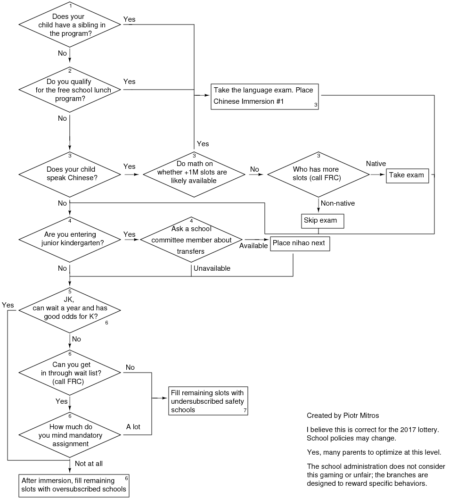

How to get into immersion Chinese
===============

I made a simplified flowchart to show how to get into immersion
Chinese. This is missing a lot of nuance but gives the basics of the
game. Footnotes explaining specific steps are below the flowchart.

I worked through this for one particular program, but once you
understand this, you'll have a good idea of how to play the Cambridge
Public School District Controlled Choice Lottery in general. If there
are aspects you don't understand, please ask me (or the FRC).

And yes, if you're shocked or outraged, that is the correct
response. My goal is to surface that complexity so we might fix it and
switch to a system which is more equitable and understandable. My
experience is the only people who successfully navigate this system
are ones with networks of parents who have gone through it before.

1. Siblings have +2M bonus points, and you're almost guaranteed to make it most years.
2. Immersion generally has free/reduced lunch slots available.
3. The exam consists of numbers, colors, household objects, shapes, and common commands. It gives +1M bonus in the lottery. If that's enough to get you in, it's worth taking. For wait-listed students, the school tries to achieve a 50/50 balance of native/non-native speakers. If you pass but there are more native speakers in the program already, it will hurt your odds. Parents faithfully pass down what's on the exam from year to year.
4. Junior kindergarten students can transfer from nihao to immersion for kindergarten ahead of the lottery. However, the school committee is talking about eliminating this option. Fortunately, their phone numbers and emails are listed on [cambridgecivic.com](http://vote.cambridgecivic.com/), and most tend to be responsive. If the transfer program is in place, a junior kindergarten spot in nihao almost guarantees a spot in immersion for kindergarten. 
5. Children eligible for junior kindergarten can go through the lottery twice, so long as they never enroll, for double the attempts and odds.
6. Mandatory assignment moves you to the front of the waiting list. By filling your list with oversubscribed schools, you can bump to the front of the line.
7. All the oversubscribed schools will fill up with #1 choices. If you list anything other than an undersubscribed school lower down, you go to mandatory assignment.
